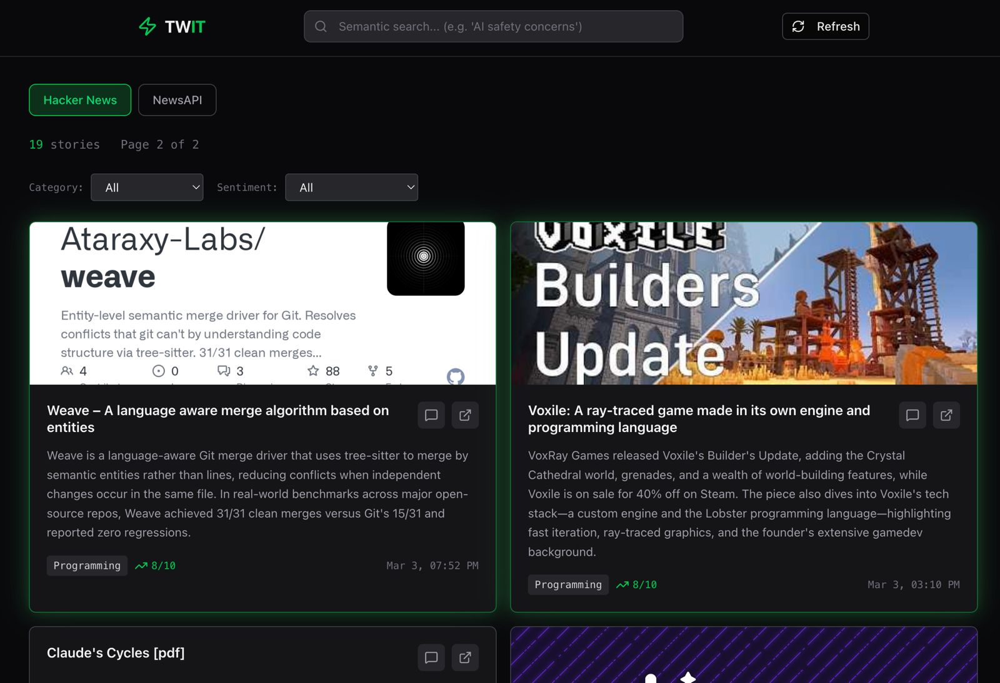

# TWIT

An AI-powered tech news aggregator that pulls stories from Hacker News and NewsAPI, generates summaries, sentiment scores, categories, and enables semantic search via pgvector embeddings.




---

## A. First-Time Setup (Local)

### 1. Install dependencies

```bash
git clone <your-repo-url>
cd Twit
npm install
```

### 2. Configure environment

Create a `.env.local` file with the following:

```bash
# --- Database ---
DATABASE_URL=your_supabase_connection_string

# --- Cron Security ---
CRON_SECRET=any_random_string

# --- Chat / Text Generation Model ---
AI_PROVIDER=azure                    # openai | anthropic | google | azure | openai-compatible
AI_MODEL=gpt-5-nano                  # Model name / deployment name
AI_API_KEY=your-api-key
AZURE_RESOURCE_NAME=your-resource    # Required for azure provider

# --- Embedding Model ---
AI_EMBEDDING_PROVIDER=azure          # openai | google | azure | openai-compatible
AI_EMBEDDING_MODEL=text-embedding-3-large
AI_EMBEDDING_DIMENSIONS=1536         # Must match DB vector column

# --- AI Rate Limits ---
AI_RPM=300                           # Requests per minute
AI_RPD=14000                         # Requests per day

# --- News Sources ---
NEWS_SOURCES=hackernews,newsapi      # Comma-separated: hackernews, newsapi
NEWSAPI_KEY=your-newsapi-key         # Required if newsapi is in NEWS_SOURCES
# NEWSAPI_PAGE_SIZE=50               # Articles per request (max 100)
# NEWSAPI_DOMAINS=                   # Optional: restrict to specific domains
```

### 3. Enable pgvector in Supabase

Go to your Supabase SQL Editor and run:

```sql
CREATE EXTENSION IF NOT EXISTS vector;
```

### 4. Push database schema

```bash
npx drizzle-kit push
```

### 5. Ingest articles

Trigger the first ingestion (fetches articles, generates AI summaries + embeddings):

```bash
curl http://localhost:3000/api/cron -H "Authorization: Bearer <your-CRON_SECRET>"
```

Or run the test ingest script:

```bash
npx tsx src/lib/test-ingest.ts
```

### 6. Start the dev server

```bash
npm run dev
```

Open http://localhost:3000

---

## B. Daily Re-runs (Normal Operation)

No manual steps needed. The Vercel cron job calls `/api/cron` once per day, which runs `ingestLatestNews()`. Duplicates are automatically skipped (URL-based deduplication).

To manually trigger locally:

```bash
curl http://localhost:3000/api/cron -H "Authorization: Bearer <your-CRON_SECRET>"
```

---

## C. Changing the Chat Model

1. Update in `.env.local`:
   - `AI_PROVIDER` (e.g., `openai`, `anthropic`, `google`, `azure`, `openai-compatible`)
   - `AI_MODEL` (e.g., `gpt-4o-mini`, `claude-sonnet-4-20250514`, `gemini-2.5-flash`)
   - `AI_API_KEY`
   - `AZURE_RESOURCE_NAME` (if using azure)
2. Restart the dev server.

**No re-processing needed.** Existing summaries, sentiment scores, and categories are plain text — they are not model-dependent.

---

## D. Changing the Embedding Model

### If dimensions stay the same:

1. Update in `.env.local`: `AI_EMBEDDING_PROVIDER`, `AI_EMBEDDING_MODEL`, `AI_EMBEDDING_API_KEY`
2. Re-embed all existing articles:
   ```bash
   npx tsx src/lib/re-embed.ts
   ```

### If dimensions change (e.g., 1536 → 3072):

1. Update in `.env.local`: `AI_EMBEDDING_PROVIDER`, `AI_EMBEDDING_MODEL`, `AI_EMBEDDING_DIMENSIONS`
2. Clear old embeddings:
   ```bash
   npx tsx src/lib/clear-embeddings.ts
   ```
3. Resize the vector column (edit `src/lib/fix-vector-column.ts` to match new dimensions first):
   ```bash
   npx tsx src/lib/fix-vector-column.ts
   ```
4. Sync schema:
   ```bash
   npx drizzle-kit push
   ```
5. Re-embed all articles:
   ```bash
   npx tsx src/lib/re-embed.ts
   ```

---

## E. Deploying to Vercel

1. Push code to GitHub.
2. Import the repo in [Vercel](https://vercel.com).
3. Add **all** env vars from `.env.local` to Vercel's Environment Variables settings.
   - **Important:** For `DATABASE_URL`, use the Supabase **pooler URL** (not the direct connection), since Vercel does not support IPv6 outbound connections.
4. Deploy.
5. Verify the cron schedule is configured in `vercel.json` for `/api/cron`.
6. Test manually:
   ```bash
   curl https://your-app.vercel.app/api/cron -H "Authorization: Bearer <your-CRON_SECRET>"
   ```

**Note:** Vercel free plan only allows one cron execution per day.

---

## Running Tests

```bash
npx tsx src/lib/test-all-features.ts
```

This runs through database connections, API integrations, AI models, semantic search, and core features.

---

## Features

- **Multi-source ingestion** — Hacker News (free) + NewsAPI.org (50+ tech articles per refresh)
- **AI summaries** — Each article gets a 2-sentence summary, sentiment score (1-10), and category
- **Semantic search** — Search by meaning using pgvector embeddings
- **Chat with articles** — Click any article to ask follow-up questions with streaming responses
- **Source tabs** — Filter news by source (Hacker News, NewsAPI)
- **Filtering** — Filter by category (AI, Security, Web, etc.) and sentiment (positive/neutral/negative)
- **Article images** — Displays og:image thumbnails from article URLs
- **Email subscription** — Collects emails for future digest feature
- **Auto-refresh** — Daily cron job fetches new stories
- **Configurable AI** — Supports OpenAI, Anthropic, Google, Azure, and OpenAI-compatible providers
- **Rate limiting** — Configurable AI RPM/RPD limits to stay within API quotas
- **Security validation** — Injection and malicious content detection on external API responses

---

## Tech Stack

- Next.js 16 (App Router)
- TypeScript
- Tailwind CSS
- Drizzle ORM
- Supabase (Postgres + pgvector)
- Vercel AI SDK
- OpenAI / Azure / Anthropic / Google AI (configurable)
- NewsAPI.org


## Misc.
- Fetch page from HN, strip all tags etc and keep only text, retrun the first 15k chars to the summariser model. NewsAPI provides summaries, use them directly